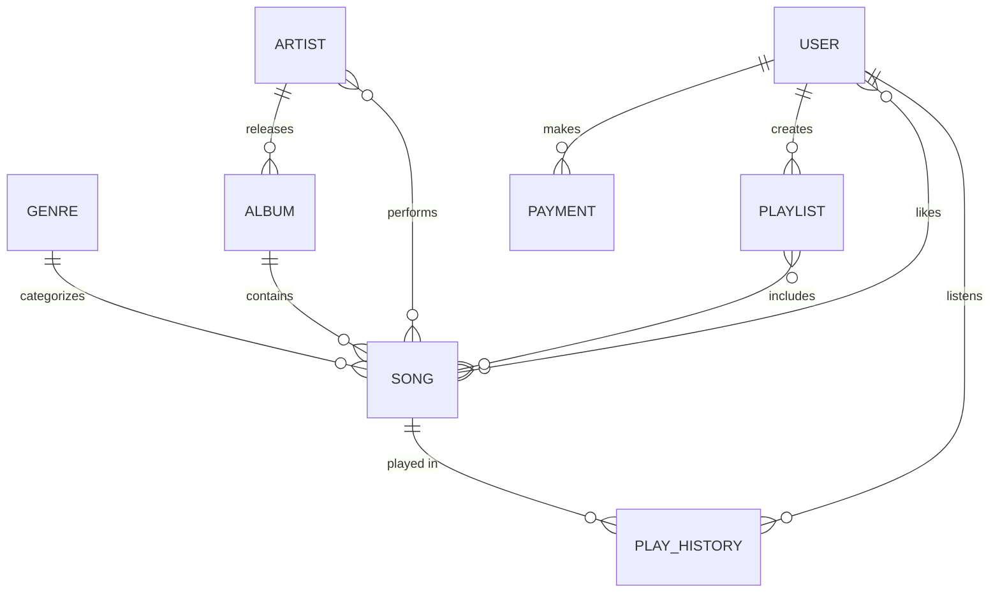

# 🎵 BeatBox: Music Streaming App (DBMS Project)

A full-stack music streaming web app. Users can register, log in, browse and search songs, like tracks, build playlists, and upgrade from a free to a premium plan.

**Stack:** MySQL + Node.js/Express + React (Vite, React Router)

> The original course version used a vanilla HTML/CSS/JS frontend. The frontend was later migrated to React; the database and API are unchanged.

## Features

- Register and log in with JWT authentication (bcrypt-hashed passwords)
- Browse all songs, see the most played, and search by title, artist, album or genre
- Like and unlike songs (optimistic UI updates)
- Create, edit and delete playlists; add and remove songs
- Artist pages with albums and their songs
- Player bar with queue, play/pause, next/previous and a progress bar (playback is simulated with a timer)
- Profile page with listening history, payment history, and a Free to Premium upgrade

## Project structure

```
beatbox/
├── backend/            Express API
│   ├── server.js       Entry point (port 3001)
│   ├── db.js           MySQL connection pool
│   ├── middleware/     JWT auth guard
│   └── routes/         auth, songs, artists, genres, playlists, users
├── database/
│   ├── schema.sql      11 tables, indexes, trigger
│   ├── seed.sql        Sample data
│   └── queries.sql     Notable queries (joins, aggregates, subqueries)
└── frontend/           React app (Vite)
    └── src/
        ├── context/    AuthContext, PlayerContext, ToastContext
        ├── components/ Sidebar, SongTable, PlayerBar, Modal, hooks
        └── pages/      Home, Search, Liked, Playlists, Artists, Profile, ...
```

## Getting started

**Prerequisites:** Node.js 18+ and MySQL 8.

### 1. Database

Load the schema, then the sample data. MySQL Workbench works well (File > Open SQL Script > Run), or from a terminal:

```
mysql -u root -p < database/schema.sql
mysql -u root -p < database/seed.sql
```

### 2. Backend

```
cd backend
npm install
copy .env.example .env      # macOS/Linux: cp .env.example .env
```

Edit `.env` and set your MySQL password (and any other values listed in `.env.example`):

```
DB_HOST=localhost
DB_PORT=3306
DB_USER=root
DB_PASSWORD=your_mysql_password
DB_NAME=beatbox
```

Then start the server:

```
npm start
```

Check it at http://localhost:3001/api/health

### 3. Frontend

In a second terminal:

```
cd frontend
npm install
npm run dev
```

Open http://localhost:5173. In development, Vite proxies `/api` requests to the backend on port 3001, so no CORS setup is needed.

### Demo login

Seeded users all have the password `password123`. See `database/seed.sql` for their email addresses.

## Database design

11 tables, normalized to 3NF:

| Table | Purpose |
|-------|---------|
| `genre`, `artist`, `album`, `song` | Music catalogue |
| `user`, `payment` | Accounts and subscriptions |
| `playlist`, `play_history` | User activity |
| `playlist_song`, `likes`, `performs` | Many-to-many junction tables (composite primary keys) |



## DBMS concepts demonstrated

| Concept | Where |
|---------|-------|
| DDL, constraints, foreign keys with `CASCADE` / `SET NULL` | `schema.sql` |
| Normalization (3NF) | Genres, artists and albums in their own tables |
| Many-to-many relationships | `playlist_song`, `likes`, `performs` |
| Indexes | Five custom indexes in `schema.sql` |
| Trigger | `after_payment_insert` upgrades a user to premium |
| Transaction (`BEGIN` / `COMMIT` / `ROLLBACK`) | `POST /api/users/me/pay` |
| Joins (inner and left), aggregates, `GROUP BY` / `HAVING` | Songs routes, `queries.sql` |
| Subquery and anti-join | `queries.sql` |
| Parameterized queries (SQL injection safe) | All route files |

## API overview

| Area | Endpoints |
|------|-----------|
| Auth | `POST /api/auth/register`, `POST /api/auth/login` |
| Songs | `GET /api/songs`, `GET /api/songs/top`, `GET /api/songs/:id`, `POST /api/songs/:id/play`, `POST` and `DELETE /api/songs/:id/like` |
| Artists | `GET /api/artists`, `GET /api/artists/:id` |
| Genres | `GET /api/genres`, `GET /api/genres/:id/songs` |
| Playlists (auth) | `GET` and `POST /api/playlists`, `GET` and `DELETE /api/playlists/:id`, `POST /api/playlists/:id/songs`, `DELETE /api/playlists/:id/songs/:sid` |
| Users (auth) | `GET /api/users/me`, `/me/liked`, `/me/history`, `/me/payments`, `POST /me/pay` |

Endpoints marked "auth" need an `Authorization: Bearer <token>` header.

## Production build

```
cd frontend
npm run build
```

This creates `frontend/dist`. To serve the built app from Express, point the static folder and SPA fallback in `backend/server.js` at `frontend/dist`.

## Troubleshooting

- **`Access denied for user 'root'`**: `backend/.env` is missing or has the wrong `DB_PASSWORD`. Restart the backend after editing it.
- **`Unknown database 'beatbox'`**: run `schema.sql` and `seed.sql` first.
- **Garbled characters in album titles**: the seed file was loaded with the wrong encoding. Re-run `seed.sql` from MySQL Workbench.